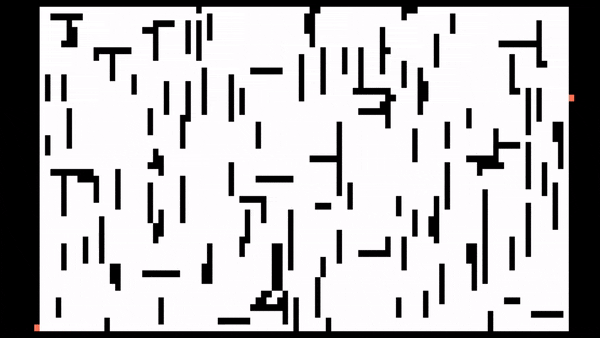

# LabPathFInder
 
## Implementation:
I used the A* pathfinding aldorithm, pygame , and an algorithm made by myself to make an script that creates pseudorandom laberinths and solve it.
My algorithm make a random branches in order to place it where its not the red dots and in a certain order.
I used pygame only for the representation of the grid and the laberinth.
This script its based ina  grid of objects. This objects are named vertex and have some propiertes like: position, width ,heigth...
Its my first time implementing this tipes of algorithms so its a tiny mess

GIF of the script working:

